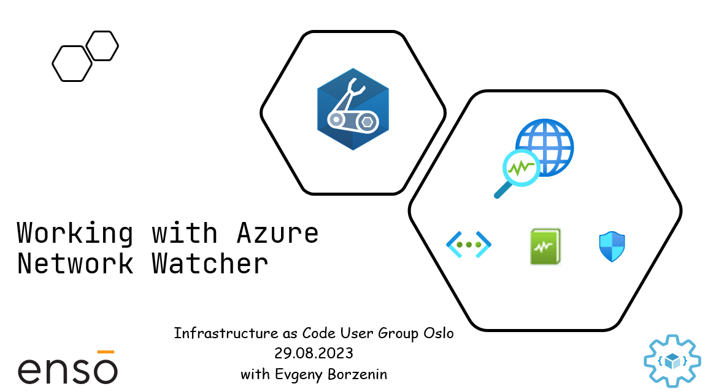

# Working with Azure Network Watcher

This is level 200 workshop that covers different aspects of working with [Azure Network Watcher](https://learn.microsoft.com/en-us/azure/network-watcher/network-watcher-monitoring-overview) where you will learn:

- How to enable Network Watcher
- How to diagnose outbound connection problems
- How to diagnose a routing problems
- How to monitor network performance
- How to log network traffic
- How to capture and analyze packets

and much more...

Workshop is organized as a combination of theoretical blocks with slides and hand-on labs. Estimated time for workshop completion is between 3 and 4 hours.

## Agenda

- Welcome + practical information
- Azure Network Watcher overview (slides)
- [Lab-01](labs/lab-01/index.md) - Provision lab resources
- [Lab-02](labs/lab-02/index.md) - Enable Network Watcher
- [Lab-03](labs/lab-03/index.md) - Use IP flow verify and NSG diagnostics to troubleshoot a VM network traffic filter problem
- [Lab-04](labs/lab-04/index.md) - Log network traffic with Network Security Group flow logs
- [Lab-05](labs/lab-05/index.md) - Network Packet Capture with Network Watcher and Wireshark
- [Lab-06](labs/lab-06/index.md) - Connection monitor
- [Lab-07](labs/lab-07/index.md) - Working with Traffic analytics
- [Lab-08](labs/lab-08/index.md) - Cleaning up resources

## Prerequisites

Please spend some time before the workshop and make sure that you have installed/registered/configured all [prerequisites](./prerequisites.md).