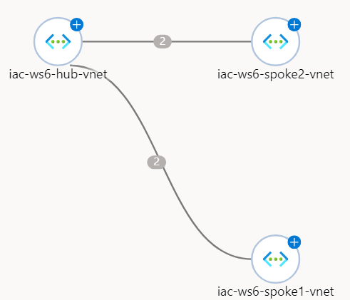

# lab-01 - provisioning of lab resources

As always, we need to provision lab environment before we can start working on the lab tasks. To make sure you have all resource providers required by lab resources, run the following commands.  

```powershell
# Make sure that all Resource Providers are registered
az provider register --namespace Microsoft.Insights
az provider register --namespace Microsoft.Network
az provider register --namespace Microsoft.OperationalInsights
az provider register --namespace Microsoft.Storage
az provider register --namespace Microsoft.Compute
az provider register --namespace microsoft.devtestlab
```

## Task #1 - Provision lab environment

Let's clone lab repo and deploy the environment.  

!!! info "Note"
    The deployment script will ask you to enter the Virtual Machines admin password. Note that supplied password must be between 8-123 characters long and must satisfy `at least 3` of password complexity requirements from the following:

    - Contains an uppercase character
    - Contains a lowercase character
    - Contains a numeric digit
    - Contains a special character
    - Control characters are not allowed

For example, `Foobar123!` is a valid password :)

```powershell
# Clone the repository to your local machine:
git clone https://github.com/Infrastructure-AsCode/azure-network-watcher

# Navigate to iac folder
cd .\azure-network-watcher\iac

# Deploy the environment
./deploy.ps1
```

Estimated deployment time is 5-10 min. 


The following resources will be deployed in your subscription under the following resource groups:

### iac-ws6-hub-rg
| Resource name | Type | Location |
|---------------|------|----------|
| iac-ws6-hub-vnet | Virtual Network | norwayeast |
| AzureBastionSubnet | Subnet | norwayeast |
| workload-snet | Subnet | norwayeast |
| iac-ws6-hub-vnet-bastion-nsg | Network Security Group | norwayeast |
| iac-ws6-hub-vnet-workload-nsg | Network Security Group | norwayeast |
| hubVm | Virtual Machine | norwayeast |
| norwayeast... | Storage Account | norwayeast |
| westeurope... | Storage Account | westeurope |
| northeurope... | Storage Account | northeurope |
| iac-ws6-...-law | Log Analytics Workspace | northeurope |


### iac-ws6-spoke1-rg
| Resource name | Type | Location |
|---------------|------|----------|
| iac-ws6-spoke1-vnet | Virtual Network | westeurope |
| workload-snet | Subnet | westeurope |
| iac-ws6-spoke1-vnet-nsg | Network Security Group | westeurope |
| spoke1Vm | Virtual Machine | westeurope |

### iac-ws6-spoke2-rg
| Resource name | Type | Location |
|---------------|------|----------|
| iac-ws6-spoke2-vnet | Virtual Network | northeurope |
| workload-snet | Subnet | northeurope |
| iac-ws6-spoke2-vnet-nsg | Network Security Group | northeurope |
| spoke2Vm | Virtual Machine | northeurope |

## The network topology



Here is Virtual Networks Address Space and Subnets configuration:

| Vnet | subnet | IP range | Location |
|------|----------| --------|----------|
| iac-ws6-hub-vnet (10.10.0.0/25) | AzureBastionSubnet | 10.10.0.0/26 | norwayeast |
| iac-ws6-hub-vnet (10.10.0.0/25) | workload-snet | 10.10.0.64/26 | norwayeast |
| iac-ws6-spoke1-vnet (10.10.0.128/26) | workload-snet | 10.10.0.128/26 | westeurope |
| iac-ws6-spoke2-vnet (10.10.0.192/26) | workload-snet | 10.10.0.192/26 | northeurope |      

## Virtual Machines configuration
| Virtual Machine name | OS | VNEt/subnet  | IP | Location |
|----------------------|----|--------------|----|----------|
| hubVm | linux | iac-ws6-hub-vnet/workload-snet | 10.10.0.68 | norwayeast |
| spoke1Vm | windows | iac-spoke1-vnet/workload-snet | 10.10.0.132 | westeurope |
| spoke2Vm | windows | iac-spoke2-vnet/workload-snet | 10.10.0.196 | northeurope |


Lab environment is implemented using Bicep and you can check the [master deployment script](/iac/main.bicep).

As always, we follow some basic conventions:

- most of the resources are prefixed with `iac-ws6-`
- for globally unique resources, like Log Analytics Workspace, Storage Accounts we generate unique string based on you subscription id and then use this unique string as part of the name. For example: 

```bicep
var varUniqueString = uniqueString(subscription().id)
name: '${parPrefix}-${uniqueString(resourceGroup().id)}-law'
```

