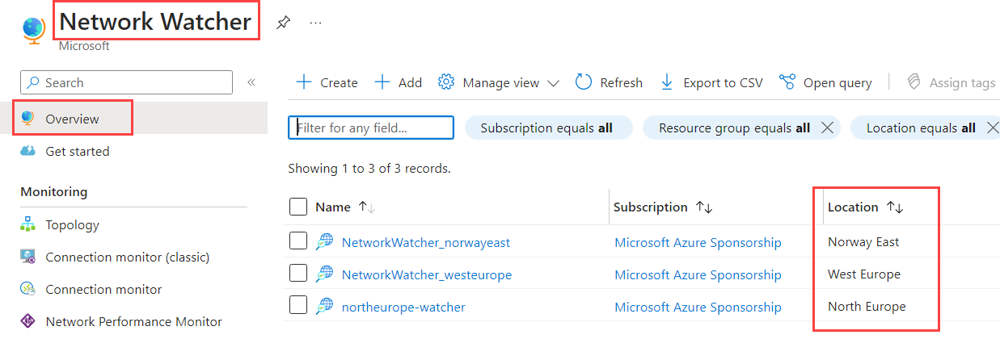
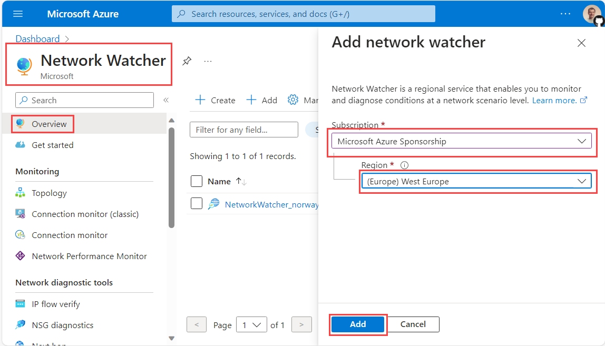
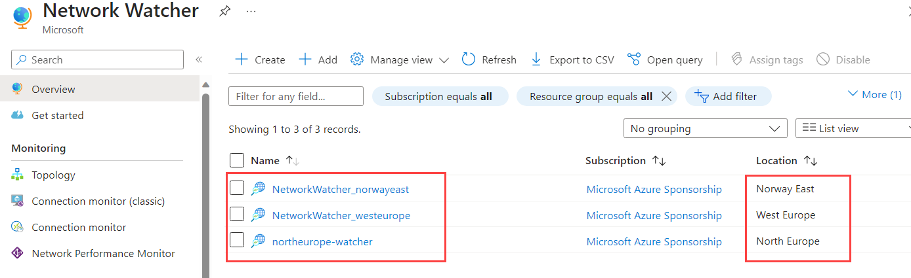

# lab-02 - enable Network Watcher

First, let's make sure that Network Watcher is enabled. Network Watcher is a regional service, so we need to enable it in each region we want to use it in. Our lab environment is deployed across three regions: `norwayeast`, `westeurope` and `northeurope`, so we need to enable it in all three regions.

## Task #1 - enable Network Watcher in `westeurope` region using Azure Portal

Let's enable Network Watcher in `westeurope` region using Azure Portal.
Navigate to [Network Watcher blade](https://portal.azure.com/#view/Microsoft_Azure_Network/NetworkWatcherMenuBlade/~/overview).

!!! info "Note"
    It's very likely that Network Watcher is already enabled in all three regions in your subscription. If that's the case, you should see all three instances of Network Watcher for `norwayeast`, `westeurope` and `northeurope`. 



!!! info "Note"
    If all Network Watcher instances are enabled, you can skip this lab!

Otherwise, let's enable it. From Overview blade, click on `+ Add` button. Select your Subscription, select `West Europe` as a region and then Click on `Add`.



!!! info "Note"
    By default, when you create a Network Watcher instance from Azure portal, the name of the instance is automatically set to `NetworkWatcher_region` and it's created in a resource group called `NetworkWatcherRG`. The resource group is created if it doesn't already exist.

## Task #2 - enable Network Watcher in `northeurope` region using Azure CLI

If you want to deploy Network Watcher in a different resource group, you can use Azure CLI or Powershell methods. 

!!! info "Note"
    The name of the Network Watcher instance is automatically set to `region-watcher`, where region corresponds to the Azure region of the Network Watcher instance. In our case, the name will be `northeurope-watcher`. The resource group must exist before you create a Network Watcher instance in it.

Let's enable Network Watcher in `northeurope` region using Azure CLI. 
If Network Watcher is already enabled in `northeurope` region, az cli command below will do nothing. 
If Network Watcher was not enabled, it will create new instance named `northeurope-watcher`.

```powershell
# make sure you are logged in and you are using correct subscription
az account show

# Create new resource group
az group create --name 'iac-ws6-networkwatcher-rg' --location 'northeurope'

# Create an instance of Network Watcher in West Europe region.
az network watcher configure --resource-group 'iac-ws6-networkwatcher-rg' --locations 'northeurope' --enabled
```

## Task #3 - enable Network Watcher in `norwayeast` region using Bicep

If you want to customize the name of a Network Watcher instance to follow your company's naming conventions, you should use PowerShell, REST API or Bicep methods. 
Let's deploy a Network Watcher instance in `norwayeast` region using Bicep.

Create new file called `main.bicep` and paste the following code:

```bicep
param parLocation string = 'norwayeast'
param parNetworkWatcherName string = 'NetworkWatcher_${parLocation}'

resource resNetworkWatcher 'Microsoft.Network/networkWatchers@2023-05-01' = {
  name: parNetworkWatcherName
  location: parLocation
  properties: {}
}
```

Then deploy it by running the following command:

```powershell
az deployment group create --resource-group 'NetworkWatcherRG' --template-file .\main.bicep
```
As in previous tasks, if Network Watcher is already enabled in `norwayeast` region, deployment will do nothing, otherwise it will create new instance named `NetworkWatcher_norwayeast`.

At that moment, you should have (at least) three Network Watcher instances deployed in three different regions.



## Useful links

- [Enable or disable Azure Network Watcher](https://learn.microsoft.com/en-us/azure/network-watcher/network-watcher-create?tabs=portal)