# lab-03 - use IP flow verify and NSG diagnostics to troubleshoot a vm network traffic filter problem

There are three Virtual Machines deployed in our lab environment. One Linux VM that is deployed into `iac-ws6-hub-vnet` virtual network and two Windows vms deployed into `iac-ws6-spoke1-vnet` and `iac-ws6-spoke2-vnet` virtual networks correspondingly.

| VM name | Vm private IP |Vnet | IP range | Location |
|-----|------|---|----------|----------|
| hubVm | 10.10.0.68 | iac-ws6-hub-vnet | 10.10.0.0/25 | norwayeast |
| spoke1Vm | 10.10.0.132 | iac-ws6-spoke1-vnet | 10.10.0.128/26 | westeurope |
| spoke1Vm | 10.10.0.196 | iac-ws6-spoke2-vnet | 10.10.0.192/26 | northeurope |      

Let's try to RDP into `spoke1Vm` using Bastion. Navigate to `Operations->Bastion` blade under `spoke1Vm`. Use `iac-admin` as `Username` and use password that you have set during the deployment of the lab environment. Click on `Connect`.

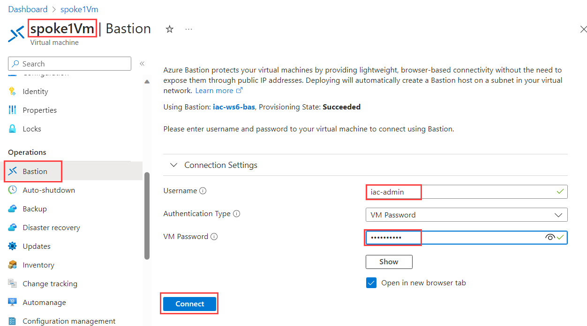

You should not be able to RDP into VM now. You should get the following error message:

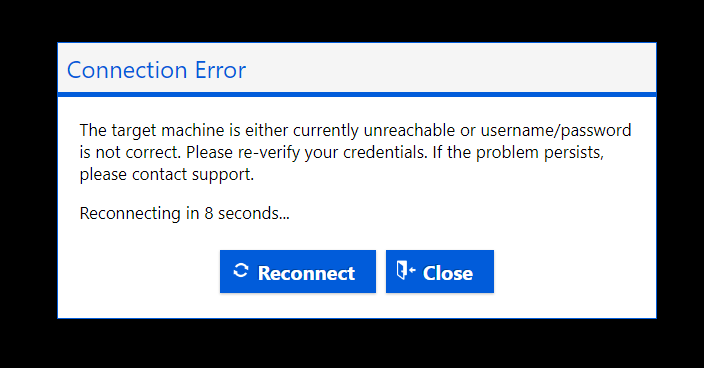

Close Bastion session and let's try to troubleshoot the problem using Network Watcher features.

## Task #1 - use `IP flow verify` to check if RDP is allowed or denied to `spoke1Vm`

Here is visualization of where we are now:
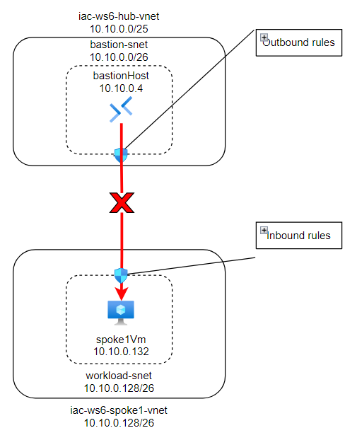

IP flow verify is a feature in Azure Network Watcher that you can use to check if a packet is allowed or denied to or from an Azure virtual machine based on the configured security rules. It helps you to troubleshoot virtual machine connectivity issues by checking network security group (NSG) rules. 

Navigate to [Network Watcher->IP flow verify](https://portal.azure.com/#view/Microsoft_Azure_Network/NetworkWatcherMenuBlade/~/verifyIPFlow) blade. 
IP flow verify uses traffic direction, protocol, local IP, remote IP, local port, and remote port to test security rules that apply to the virtual machine's network interface. 

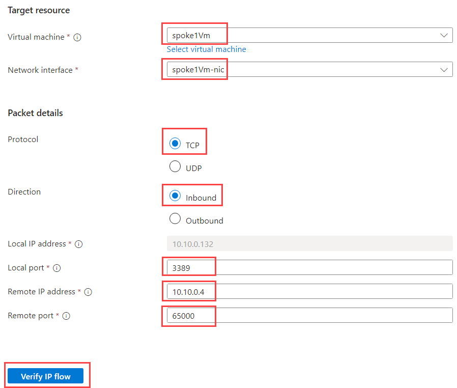

Fill in the following information:

| Field | Value |
|-------|-------|
| Virtual machine | Select `spoke1Vm` |
| Network interface | Select `spoke1Vm-nic` |
| Protocol | Select `TCP` |
| Direction | Select `Inbound` |
| Local IP address | Preselected. Should be IP associated with spoke1Vm-nic - `10.10.0.132`  |
| Local port | Enter `3389` |
| Remote IP address | Enter one of the IPs from bastion subnet range, for example `10.10.0.4`  |
| Remote port | Any port, let's use 65000 |

When filled, click on `Verify IP flow`. We should get `Access denied` result:

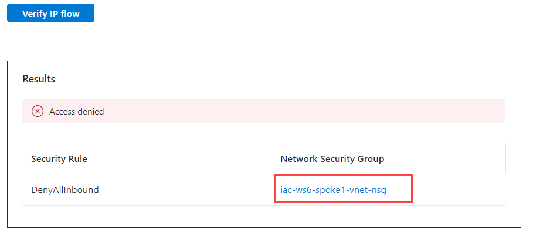

From the result we can see that `DenyAllInbound` rule of `iac-ws6-spoke1-vnet-nsg` network Security Group is not allowing RDP traffic from bastion subnet. Let's get more details by using another Network Watcher feature called `NSG diagnostic`.

## Task #2 - use `NSG diagnostic` to check if RDP is allowed or denied to `spoke1Vm`

Similar to IP flow verify, NSG diagnostics is a feature in Azure Network Watcher that you can use to check if a packet is allowed or denied to or from an Azure virtual machine based on the configured security rules. It helps you to troubleshoot virtual machine connectivity issues by checking network security group (NSG) rules.

Navigate to [Network Watcher->NSG diagnostic](https://portal.azure.com/#view/Microsoft_Azure_Network/NetworkWatcherMenuBlade/~/nsgDiagnostic) blade.

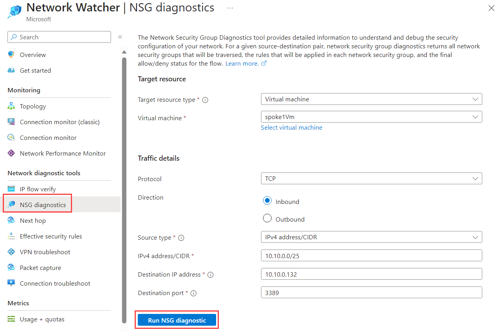

Fill in the following information:

| Field | Value |
|-------|-------|
| Target source type | Select `Virtual machine` |
| Virtual machine | Select `spoke1Vm` |
| Protocol | Select `TCP` |
| Direction | Select `Inbound` |
| Source type | Select `IPv4 address/CIDR` |
| IPv4 address/CIDR | Enter `10.10.0.0/26` - bastion-snet subnet address range |
| Destination IP address |  `10.10.0.132` - `spoke1Vm` IP address  |
| Destination port | Enter `3389` |

When filled, click on `Run NSG diagnostic`. We should get the following result:

Click on `View details` and you will see detailed NSG diagnostic of the traffic flow:

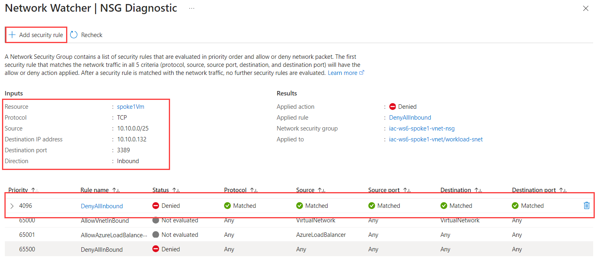

THis view shows what was our Input, what was the results and which NSG rule blocked the traffic. 

As you can see, the traffic is blocked by `DenyAllInbound` rule of `iac-ws6-spoke1-vnet-nsg` network Security Group. To allow the traffic, we need to add new rule that will allow RDP traffic from bastion subnet into `iac-ws6-spoke1-vnet` virtual network.
We can create new rule right from the NSG diagnostic blade. Click on `Add security rule`.

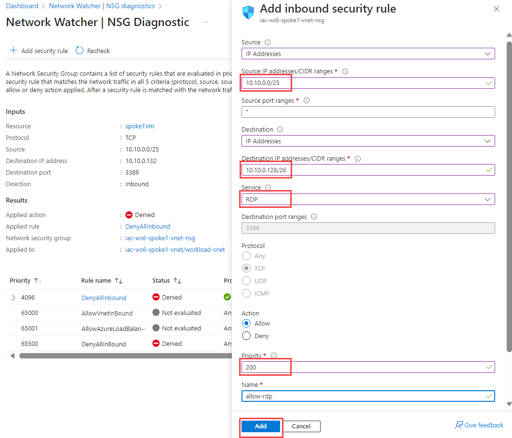

Fill in the following information:

| Field | Value |
|-------|-------|
| Source | Select `IP addresses` |
| Source IP addresses/CIDR ranges | Enter `10.10.0.0/26` - bastion subnet |
| Source port ranges | Enter `*` |
| Destination | Select `IP addresses` |
| Destination IP addresses/CIDR ranges | Enter `10.10.0.128/26` - iac-ws6-spoke1-vnet IP range |
| Service | Select `RDP` |
| Action | Select `Allow` |
| Priority | Enter `200` |
| Name | Enter `allow-rdp` |

When filled, click on `Add`. You should see new NSG rule added.

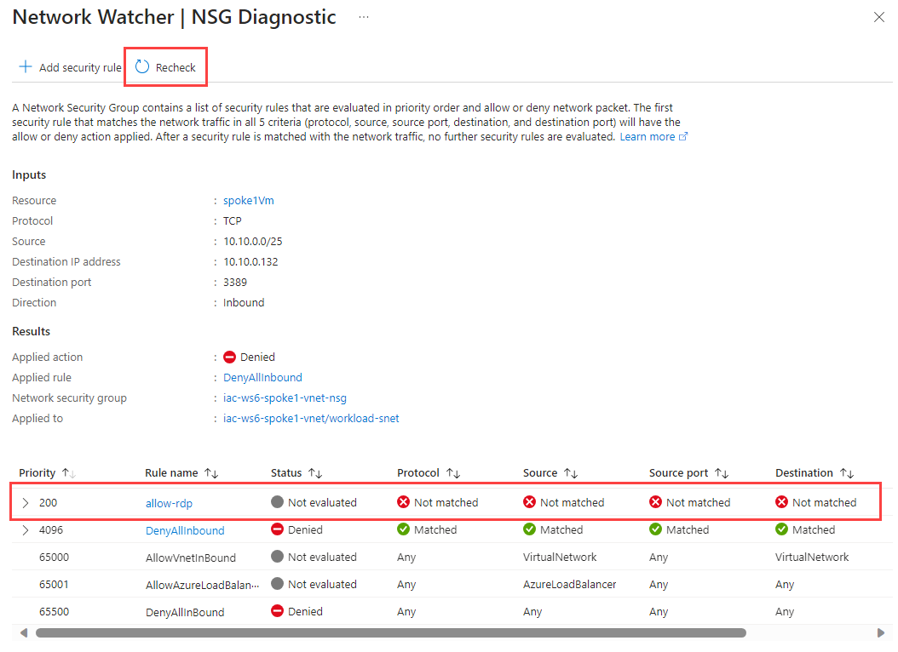

It takes some time for NSG changes to take effect, so wait 30-60 sec and click `Recheck`. Now you should see that traffic is allowed.

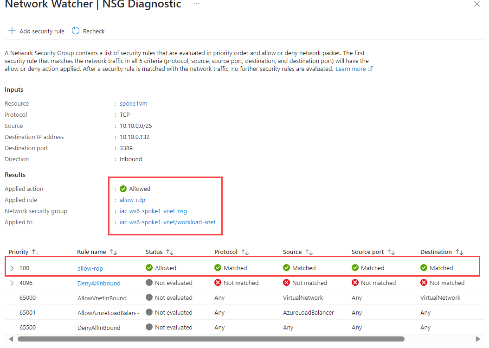

Now, let's try to RDP into `spoke1Vm` using Bastion again. Navigate to `Operations->Bastion` blade under `spoke1Vm`. Use `ìac-admin` as `Username` and use password that you have set during the deployment of the lab environment. Click on `Connect`. You should now be able to connect to `spoke1Vm`!

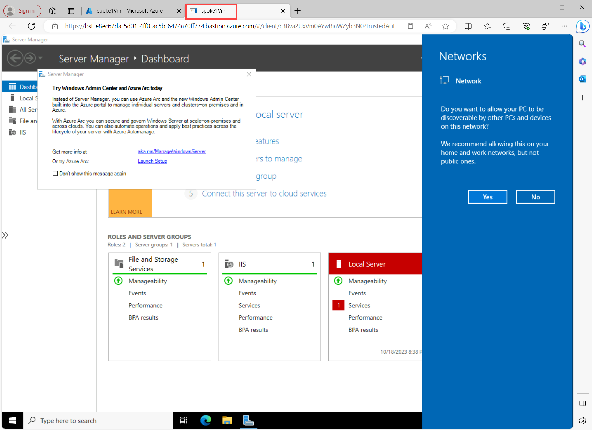

Here is another way to visualize how did we fix the problem:

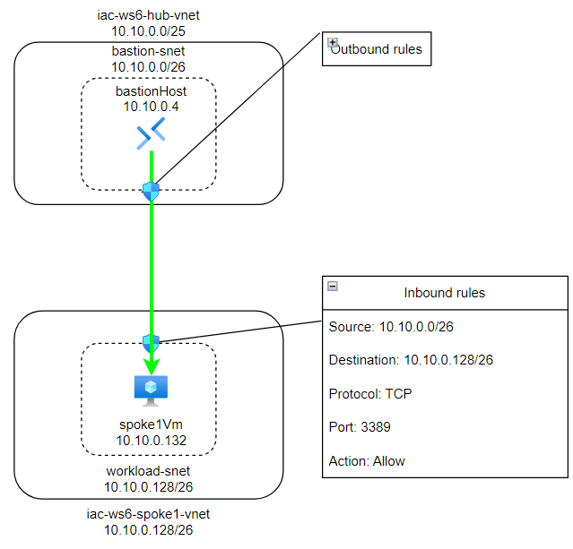

## Task #3 - use `NSG diagnostic` and/or `IP flow verify` tools to check if RDP is allowed or denied to `spoke2Vm`

Do the same exercise for second Windows VM - `spoke2Vm`. If you can't RDP into it, fix it.

Test that you can RDP into `spoke2Vm` using Bastion.

## Task #4 - use `NSG diagnostic` and/or `IP flow verify` tools to check if SSH is allowed or denied to `hubVm`

Do the same exercise for Linux VM - `hub2Vm`. If you can't SSH into it, fix it.
Test that you can SSH into `hub2Vm` using Bastion.
