# lab-04 - log network traffic with Network Security Group flow logs

Network security groups (NSG) flow logging is a feature of Azure Network Watcher that allows you to log information about IP traffic flowing through a network security group. Flow data is sent to Azure Storage from where you can access it and export it to any visualization tool.

In this lab we will enable NSG flow logs for `iac-ws6-spoke1-vnet-nsg` and `iac-ws6-spoke2-vnet-nsg` NSGs and then we will use Azure Storage Explorer to view the logs and troubleshoot connectivity issues.

## Task #1 - enable NSG flow logs for `iac-ws6-spoke2-vnet-nsg` using Azure portal

Navigate to `Monitoring->NSG flow logs` blade of `iac-ws6-spoke2-vnet-nsg` Network Security Group resource and click on `Create`.

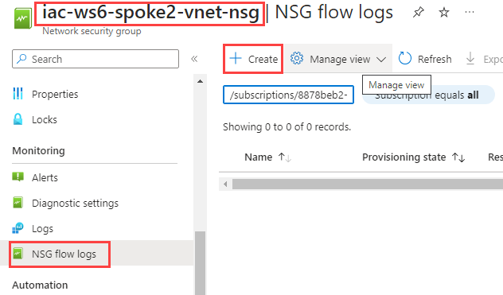

At the `Basic` tab, select your Subscription and click on `Select resource`

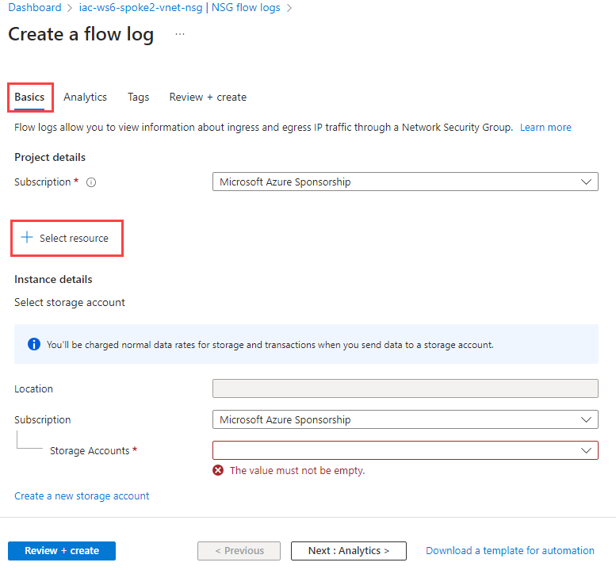

From the list of available NSGs, select `iac-ws6-spoke2-vnet-nsg` and click on `Confirm selection`

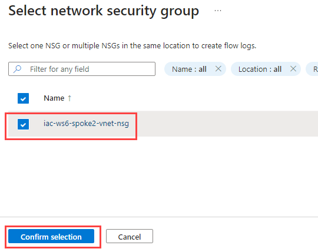

Under the `Instance details` section, select `Storage account` that starts with `northeuropexxx`, set `Retention (days)` to 30 and click on `Next: Analytics >`

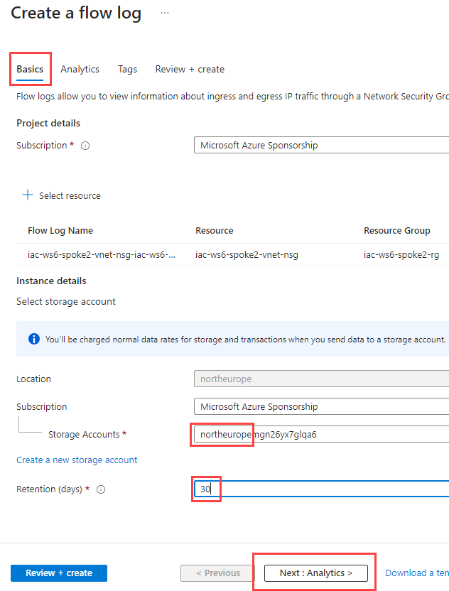

At the `Analytics` tab:
- select `Flow Logs Version` to `Version 2`
- enable Traffic Analytics
- set `Traffic Analytics processing interval` to every 10 min
- select `iac-ws6-.....-law` as `Log Analytics Workspace`  

When filled, click on `Review + create` and then on `Create`

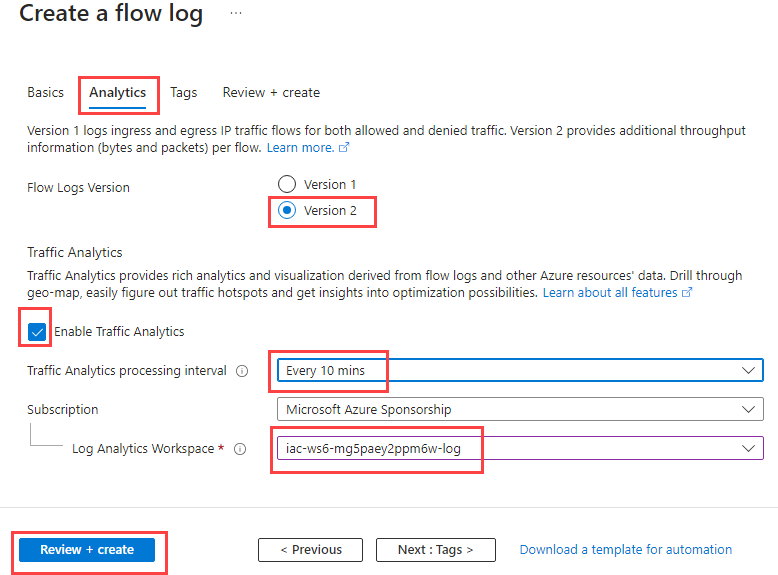

## Task #2 - enable NSG flow logs for `iac-ws6-spoke1-vnet-nsg` using Bicep

Let's configure flow logs for `iac-ws6-spoke1-vnet-nsg` using Bicep. We need to collect some resource ids first. 

```powershell
# Get Network Security Group Id. It will be used as a parNsgId parameter for Bicep template.
az network nsg show -n iac-ws6-spoke1-vnet-nsg -g iac-ws6-spoke1-rg --query id -otsv

# Get Storage Account Id for SA located at NorthEurope. It will be used as a parStorageId parameter for Bicep template.
az storage account list -g iac-ws6-hub-rg --query "[?location=='westeurope'].id" -otsv

# Get Log Analytics Workspace Id. It will be used as a parWorkspaceResourceId parameter for Bicep template. 
az monitor log-analytics workspace list -g iac-ws6-hub-rg --query [0].id -otsv
```

Create new `flowlogs.bicep` file with the following content. Use ids we collected in previous step to fill in parameters.

```bicep
param parLocation string = 'westeurope'
param parNsgId string = ''
param parStorageId string = ''
param parWorkspaceResourceId string = ''
param parNetworkWatcherName string = 'NetworkWatcher_${parLocation}'
param parFlowlogName string = 'iac-ws6-spoke1-vnet-nsg-flowlog'

resource resFlowlogBastionNsg 'Microsoft.Network/networkWatchers/flowLogs@2023-05-01' = {
  name: '${parNetworkWatcherName}/${parFlowlogName}'
  location: parLocation
  properties: {
    targetResourceId: parNsgId
    storageId: parStorageId
    enabled: true
    format: {
      type: 'JSON'
      version: 2
    }
    flowAnalyticsConfiguration: {
      networkWatcherFlowAnalyticsConfiguration: {
        enabled: true
        workspaceRegion: 'norwayeast'
        workspaceResourceId: parWorkspaceResourceId
        trafficAnalyticsInterval: 10
      }
    }
    retentionPolicy: {
      days: 30
      enabled: true
    }
  }
}
```

Deploy Bicep template using the following command:

```powershell
az deployment group create --resource-group 'NetworkWatcherRG' --template-file .\flowlogs.bicep
```	

If you now go to [Network Watcher -> Flow logs](https://portal.azure.com/#view/Microsoft_Azure_Network/NetworkWatcherMenuBlade/~/flowLogs), you should see that all four Network Security Groups used in our lab environment have now flow logs enabled.


## Task #3 - generate some traffic from `hubVm` to `spoke1Vm`

Use Bastion and initiate SSH session into `hubVm`. Once connected, run the following command to generate some traffic from `hubVm` to `spoke1Vm` with private IP 10.10.0.132:

```bash
iac-admin@hubVm:~$ curl http://10.10.0.132
curl: (7) Failed to connect to 10.10.0.132 port 80: Connection timed out
```

The command will fail with timeout. Now, let's use NSG flow logs to find out why. NSG flow logs are store into Azure Storage Account. There are several ways how to access them. We will use `Azure Storage Explorer`. Download and install it from [here](https://azure.microsoft.com/en-us/features/storage-explorer/) or use winget to install it (Windows only):

```powershell
winget install --id=Microsoft.Azure.StorageExplorer  -e
```

Once installed, connect to your subscription. NSG flow logs is regional product and it stores logs to the Storage Account located at the same region where NSG is deployed. 

`hubVm` is deployed into `workload-snet` subnet with `iac-ws6-hub-vnet-workload-nsg` NSG assigned to it. Check what Storage account is used for `iac-ws6-hub-vnet-workload-nsg` NSG flow logs.

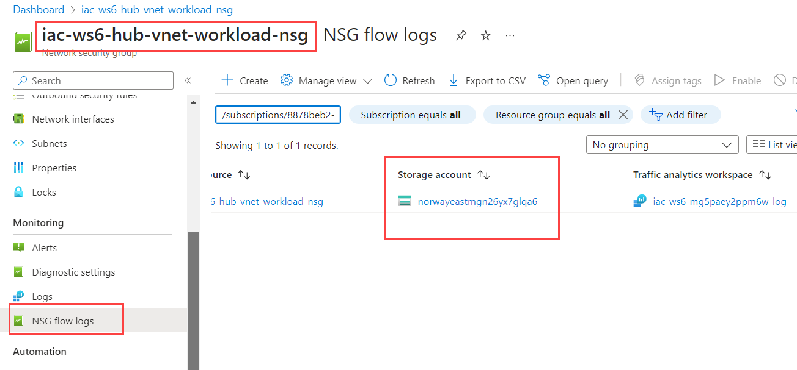


At the `Azure Storage Explorer`, navigate to `Storage Accounts` and select storage account you just checked (its name starts with `norwayeast...`). 

NSG log files are written to a folder hierarchy that follows the following naming convention:

```txt
https://{storageAccountName}.blob.core.windows.net/insights-laws-networksecuritygroupflowevent/resourceId=/SUBSCRIPTIONS/{subscriptionID}/RESOURCEGROUPS/{resourceGroupName}/PROVIDERS/MICROSOFT.NETWORK/NETWORKSECURITYGROUPS/{networSecurityGroupName}/y={year}/m={month}/d={day}/h={hour}/m=00/macAddress={acAddress}/PT1H.json
```

Select `Blob Containers->insights-laws-networksecuritygroupflowevent` and navigate the folder hierarchy at the right side until you get to the PT1H.json file (just double click on the folders to navigate). At some point, you will get to the folder with two NSG names. Choose NSG called `iac-ws6-hub-vnet-workload-nsg`. 

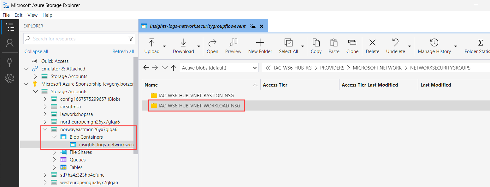

Then navigate to the folder with current date and hour. You should see something like this:

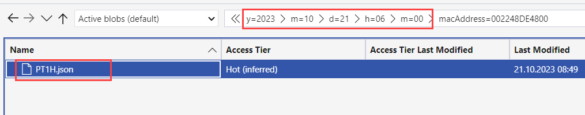

Download the `PT1H.json` file and open it in your favorite text editor. 
Search for `10.10.0.132` IP address that we used to generate traffic from `hubVm`.
The following example is a section taken from my PT1H.json file, which shows a flows where `10.10.0.132` was part of.

```json
{
    "time": "2023-10-21T05:40:55.1402895Z",
    "systemId": "7b82301a-efc1-449f-89cb-c39da226f372",
    "macAddress": "002248DE4800",
    "category": "NetworkSecurityGroupFlowEvent",
    "resourceId": "/SUBSCRIPTIONS/00000000-0000-0000-0000-000000000000/RESOURCEGROUPS/IAC-WS6-HUB-RG/PROVIDERS/MICROSOFT.NETWORK/NETWORKSECURITYGROUPS/IAC-WS6-HUB-VNET-WORKLOAD-NSG",
    "operationName": "NetworkSecurityGroupFlowEvents",
    "properties":
    {
        "Version": 2,
        "flows":
        [
            {
                "rule": "UserRule_DenyAllOutbound",
                "flows":
                [
                    {
                        "mac": "002248DE4800",
                        "flowTuples":
                        [
                            "1697867296,10.10.0.68,10.10.0.132,57182,80,T,O,D,B,,,,",
                        ]
                    }
                ]
            }
        ]
    }
}
```

The comma-separated information for `flowTuples` is as follows:

| Example data | What data represents| Description |
|--------------|---------------------|-------------|
| 1697867296 | Time stamp | The time stamp of when the flow occurred in UNIX EPOCH format. In the previous example, the date converts to February 26, 2023 11:44:57 PM UTC/GMT. |
| 10.10.0.68 | Source IP address | The source IP address that the flow originated from. `10.10.0.68` is the private IP address of the `hubVm`. |
| 10.10.0.132 | Destination IP address | The destination IP address that the flow was destined to. `10.10.0.132` is the private IP address of the `spoke1Vm` |
| 57182 | Source port | The source port that the flow originated from. |
| 80 | Destination port | The destination port that the flow was destined to. We generated HTTP traffic at port 80 |
| T | Protocol | The protocol that the flow was destined to. `T` stands for TCP |
| O | Traffic flow direction | The direction of the flow. `O` stands for outbound |
| D | Traffic flow state | The state of the flow. `D` stands for denied |
| B | Traffic flow action | The action that was taken on the flow. `B` stands for blocked |

From here we know that traffic was blocked and it was blocked by the `UserRule_DenyAllOutbound` rule.

## Task #4 - allow outbound HTTP traffic from `hubVm` to `spoke1Vm`

We need to allow outbound HTTP traffic at `workload-snet`. Add new outbound rule to `iac-ws6-hub-vnet-workload-nsg` NSG rule that allows TCP traffic at port 80 from `iac-ws6-hub-vnet` to `iac-ws6-spoke1-vnet`.

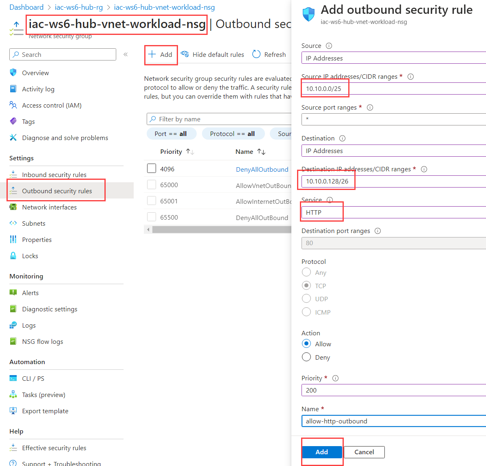

Fill in the following parameters:

| Parameter | Value |
|-----------|-------|
| Source | `10.10.0.0/25` - iac-ws6-hub-vnet |
| Source port ranges | `*` |
| Destination | `10.10.0.128/26` - iac-ws6-spoke1-vnet |
| Source | `HTTP` |
| Action | `Allow` |
| Priority | `200` |
| Name | `allow-http-outbound` |

When filled, click on `Add`. It might take up to 1 minute before new rule will be applied.

Go back to SSH session at `hubVm` and try to call `spoke1Vm` again:

```bash
iac-admin@hubVm:~$ curl http://10.10.0.132
curl: (7) Failed to connect to 10.10.0.132 port 80: Connection timed out
```

We still get timeout. Let's check NSG flow logs of `iac-ws6-hub-vnet-workload-nsg` again. This time you should see something similar to this flowTuples

```txt
"1697872527,10.10.0.68,10.10.0.132,36852,80,T,O,A,B,,,,"
```

As you can see, the action is now `A` which stands for `allowed`. That means that connection is now allowed, but it still fails. Let's check NSG flow logs of the receiving end - `iac-ws6-spoke1-vnet-nsg`.

## Task #5 - check NSG flow logs of `iac-ws6-spoke1-vnet-nsg` network security group

Check what storage account is configured for `iac-ws6-spoke1-vnet-nsg`.

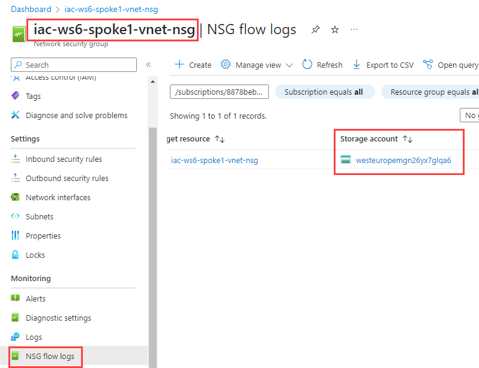

Download `PT1H.json` file, open it and search for flow tuples containing `10.10.0.68,10.10.0.132`. You should find something similar to this:

```txt
"1697964965,10.10.0.68,10.10.0.132,40142,80,T,I,D,B,,,,"
```

As you can see, the action is `D` which stands for `denied`. Let's fix that. 

## Task #6 - allow inbound HTTP traffic from `hubVm` to `spoke1Vm`

Add new inbound rule to `iac-ws6-spoke1-vnet-nsg` NSG rule that allows HTTP traffic from `iac-ws6-hub-vnet` to `iac-ws6-spoke1-vnet`.

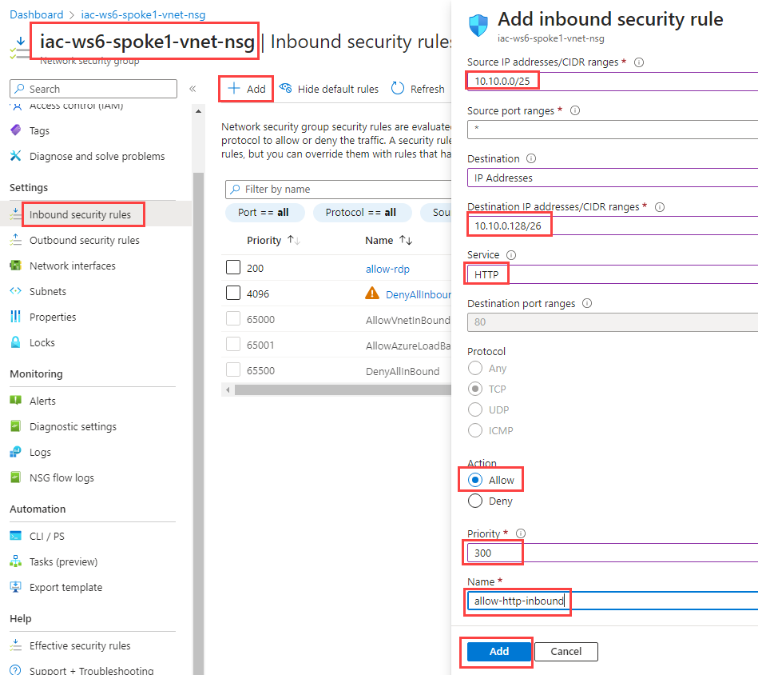

Fill in the following parameters:

| Parameter | Value |
|-----------|-------|
| Source | `10.10.0.0/25` - iac-ws6-hub-vnet |
| Source port ranges | `*` |
| Destination | `10.10.0.128/26` - iac-ws6-spoke1-vnet |
| Source | `HTTP` |
| Action | `Allow` |
| Priority | `300` |
| Name | `allow-http-inbound` |

When filled, click on `Add`. It might take up to 1 minute before new rule will be applied.

Go back to SSH session at `hubVm` and try to call `spoke1Vm` again:

```bash
iac-admin@hubVm:~$ curl http://10.10.0.132
Hello from spoke1Vm
```

You should now see a response from `spoke1Vm` in form of `Hello from spoke1Vm` message.

## Task #7 - repeat the same exercise for `spoke2Vm`

- try to access `spoke2Vm` from `hubVm` using SSH
- using NSG flow logs of `iac-ws6-hub-vnet-workload-nsg` and `iac-ws6-spoke2-vnet-nsg` NSGs, identify if traffic is blocked and fix it by adding corresponding NSG rules
- make sure that `spoke2Vm` response with `Hello from spoke2Vm` message