# lab-06 - Connection monitor

Connection Monitor provides unified, end-to-end connection monitoring in Azure Network Watcher. The Connection Monitor feature supports hybrid and Azure cloud deployments. Network Watcher provides tools to monitor, diagnose, and view connectivity-related metrics for your Azure deployments.

In this lab we will create connectivity tests that will test `HTTP` and `ICMP (aka ping)` connectivity from `hubVM` towards `spoke1Vm` and `spoke2Vm`.

## Task #1 - create connectivity monitor

Navigate to [Network Watcher->Connection monitor](https://portal.azure.com/#view/Microsoft_Azure_Network/NetworkWatcherMenuBlade/~/connectionMonitor) blade and click on `+ Create`.

At the Basic tab, fill in the following information: 

| Property | Value |
|-------|-------|
| Connection MOnitor Name | Enter `iac-ws6-connection-monitor` |
| Subscription | Select your subscription |
| Resource | Select `Norway East` |
| Use workspace created by connection monitor | Should be unchecked |
| Workspace | Select one we use in the lab (its name starts with `iac-ws6-`) |

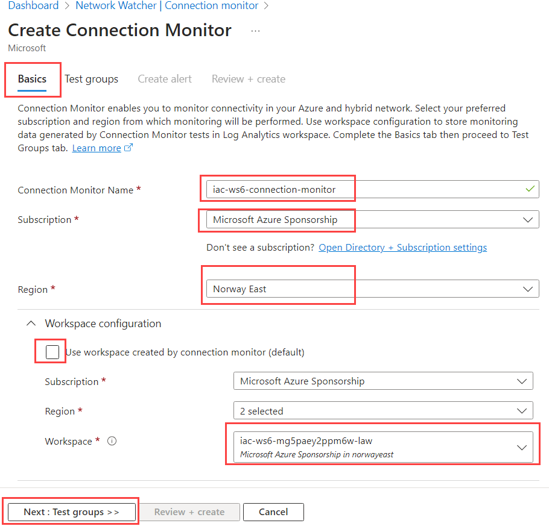

At the `Add test group details` page, enter `TG1` as a test group name and click on `Add sources`. 

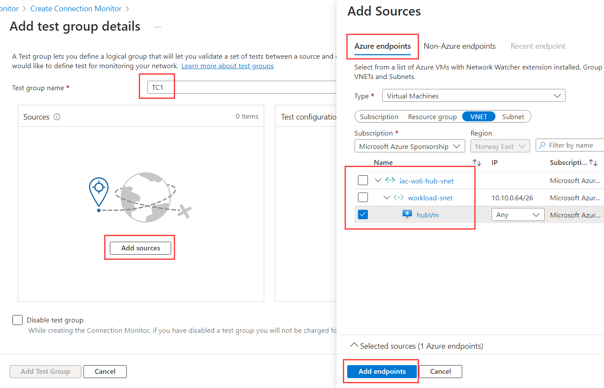

At the `Add sources->Azure endpoints` tab, select `hubVm` as a source endpoint and click on `Add endpoints`. 

!!! info "Note"
    Make sure that you select Virtual Machine, not Virtual Network!

At the `Add test group details` page click on `Add destinations`. 

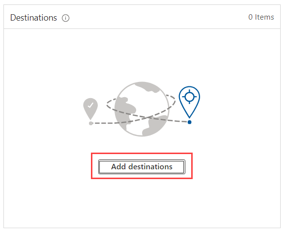

At the `Add destinations->Azure endpoints` tab, select `spoke1Vm` and `spoke2Vm` as a destination endpoints and click on `Add endpoints`.

!!! info "Note"
    Make sure that you select Virtual Machine, not Virtual Network!

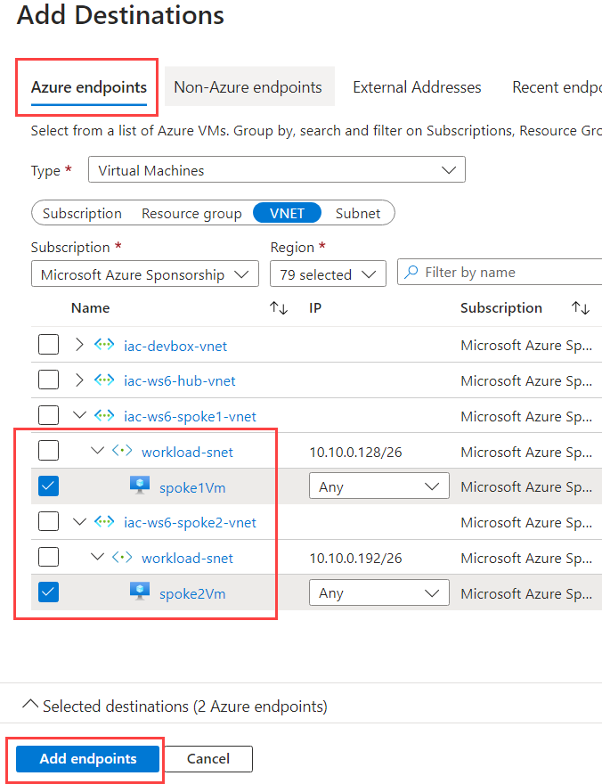

At the `Add test group details` page click on `Add Test configuration`. 

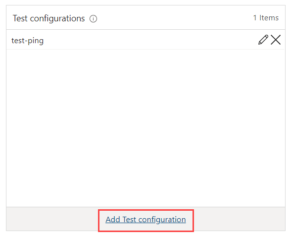

At the `Add Test configuration` page, name test as `test-ping`, select `ICMP` from protocol list and click on `Add test configuration`.

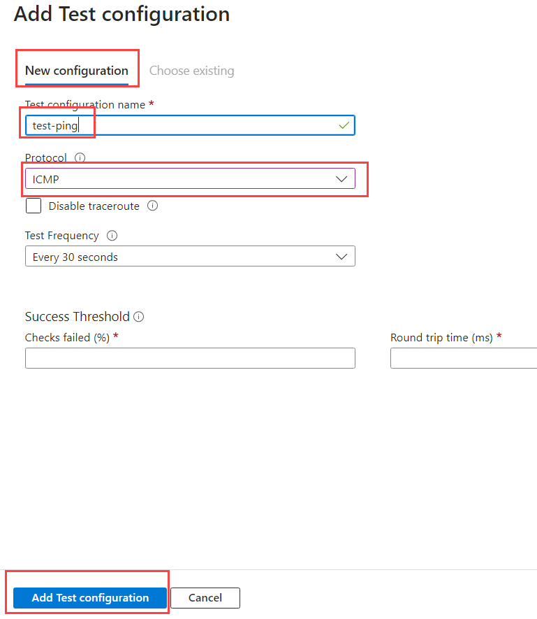

Add another test configuration. This time name it `test-http` and select `HTTP` from protocol list. Keep the rest of the parameters as default and click on `Add test configuration`.

Back to `Test groups`, click on ``Review + create` and then on `Create`.

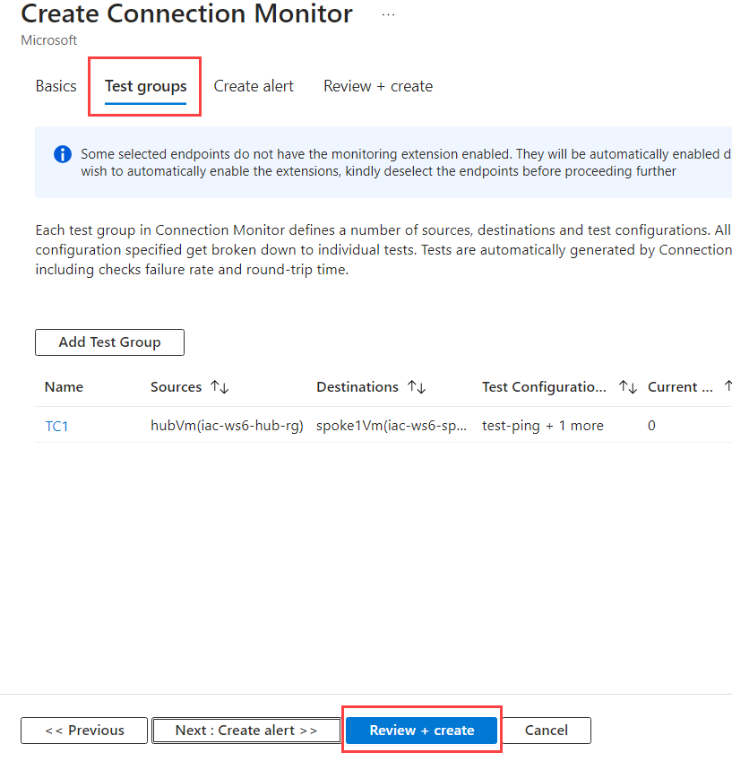

You should see something similar to this:

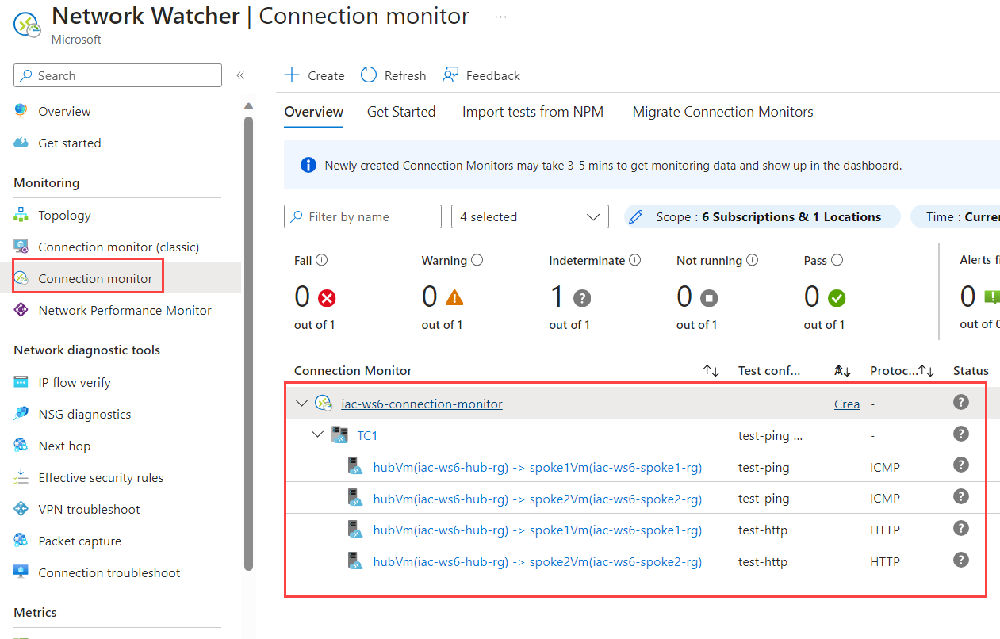

It might tame some minutes before first tests results will be available and this page will show some data. 

## Task #2 - analyze test results

When tests results will be available, you can use this page to analyze your connectivity.

From the [Network Watcher -> Connection monitor](https://portal.azure.com/#view/Microsoft_Azure_Network/NetworkWatcherMenuBlade/~/connectionMonitor) page, expand  `iac-ws6-connection-monitor` instance and click on `TG1` tests group.

The summarized view will show you the status of all tests included into this group:
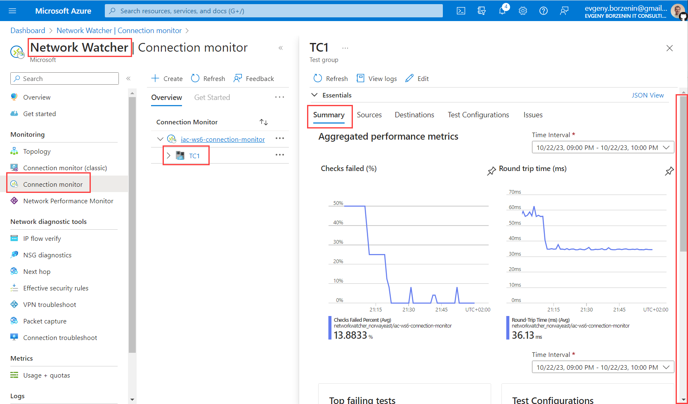

You can find the aggregated perfomance metrics and RTT graphs, Top failing tests, Sources and Destinations with percentage of failing tests. Spends some time and "click around" this page to get familiar with the data.

Navigate to `Destinations` tab.
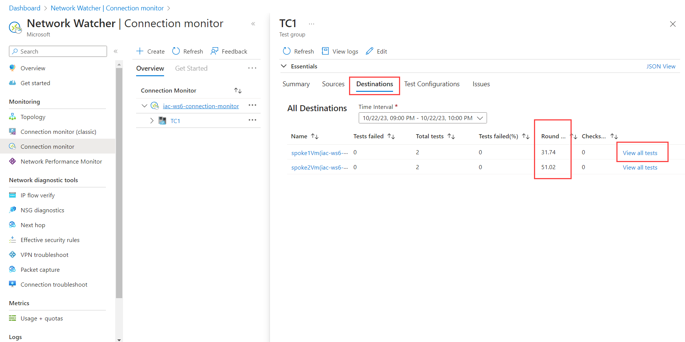

Here you can see the status of all tests from this group for each destination. You can also see the aggregated railed tests % and RTT for each destination, and you can drill down to `View all tests` to get more details.

For each individual test you can see test topology and Performance charts.
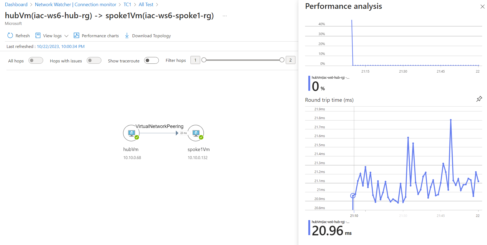
