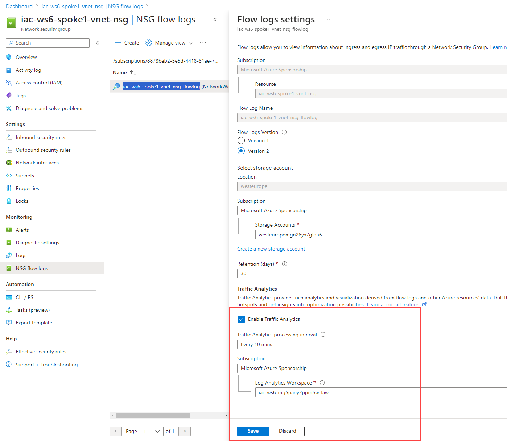
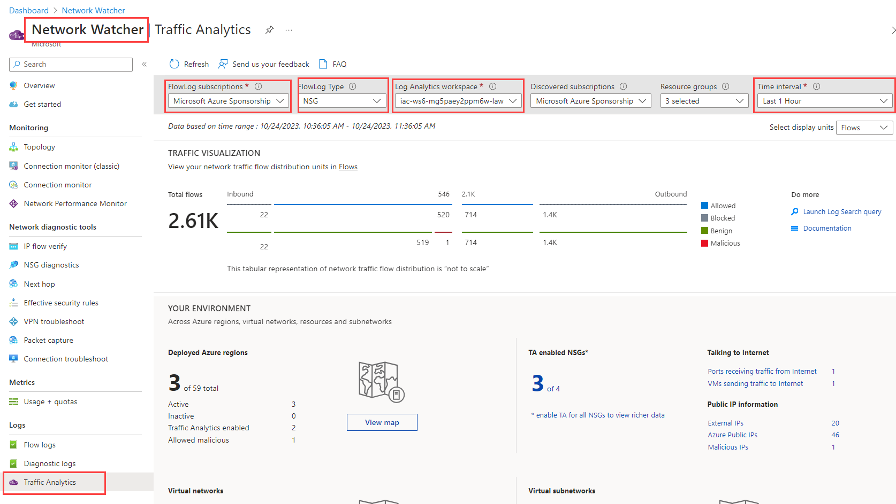

# Lab-07 - Working with Traffic analytics

Traffic analytics is a cloud-based solution that provides visibility into user and application activity in your Azure Virtual Networks. Traffic analytics analyzes Azure Network Watcher flow logs to provide insights into traffic flow in your Azure cloud. With traffic analytics, you can:

- Visualize network activity across your Azure subscriptions.
- Identify hot spots.
- Secure your network by using information about the following components to identify threats:
  - Open ports
  - Applications that attempt to access the internet

To use traffic analytics, you need the following components:
- Network watcher
- Log Analytics Workspace
- NSG with NSG flow logs enabled

Traffic analytics examines raw flow logs. It then reduces the log volume by aggregating flows that have a common source IP address, destination IP address, destination port, and protocol. Reduced logs are enhanced with geography, security, and topology information and then stored in a Log Analytics workspace. 


During previous labs, we already enabled Network watcher, we initially provisioned Log Analytics workspace, NSGs and configured NSG flow logs. Now let's enable Traffic analytics.

## Task #1 - Enable Traffic analytics from Azure Portal

At the Azure portal, Traffic Analytics is configured at the same place as NSG Flow Logs (but it can be done afterwards). Open `iac-ws6-spoke1-vnet-nsg` and navigate to `Monitoring->NSG flow logs` tab and click on `iac-ws6-spoke1-vnet-nsg-flowlog`


As you can see, Traffic Analytics is already enabled. We did it during `lab-04` when we configured NSG flow logs. The reason we did it earlier is to let Traffic Analytics to collect some data while we were working with labs. 




Here is what you can configure:

- Traffic Analytics processing interval - can be either 10 min or 1 hour
- Log Analytics Workspace - Log Analytics where Traffic Analytics will store aggregated data


## Task #2 - Enable Traffic analytics using Bicep

Traffic Analytics configuration is part of `Microsoft.Network/networkWatchers/flowLogs` resource. We already enabled Traffic Analytics for `iac-ws6-spoke1-vnet-nsg` during `lab-04`. `networkWatcherFlowAnalyticsConfiguration` section is responsible for Traffic Analytics configuration.
The same way as at the Portal, you can configure Log Analytics Workspace (`workspaceResourceId` property) and processing interval (`trafficAnalyticsInterval`). 

```bicep
param parLocation string = 'westeurope'
param parNsgId string = ''
param parStorageId string = ''
param parWorkspaceResourceId string = ''
param parNetworkWatcherName string = 'NetworkWatcher_${parLocation}'
param parFlowlogName string = 'iac-ws6-spoke1-vnet-nsg-flowlog'

resource resFlowlogBastionNsg 'Microsoft.Network/networkWatchers/flowLogs@2023-05-01' = {
  name: '${parNetworkWatcherName}/${parFlowlogName}'
  location: parLocation
  properties: {
    targetResourceId: parNsgId
    storageId: parStorageId
    enabled: true
    format: {
      type: 'JSON'
      version: 2
    }
    flowAnalyticsConfiguration: {
      networkWatcherFlowAnalyticsConfiguration: {
        enabled: true
        workspaceRegion: 'norwayeast'
        workspaceResourceId: parWorkspaceResourceId
        trafficAnalyticsInterval: 10
      }
    }
    retentionPolicy: {
      days: 30
      enabled: true
    }
  }
}
```

## Task 3 - Explore Traffic analytics data

Let's explore Traffic analytics data. Navigate to [Network Watcher->Traffic Analytics](https://portal.azure.com/#view/Microsoft_Azure_Network/NetworkWatcherMenuBlade/~/trafficAnalytics).



Make sure that you have a correct configuration for:
| Parameter | Value |
|-------|-------|
| FlowLog subscriptions| Select your subscription |
| FlowLog type| Select NSG |
| Log Analytics workspaces | Select law used in our lab |
| Time interval | Set it to 30 min or 1 hour |

You should already see some data.


Follow the instructions from [this document](https://learn.microsoft.com/en-us/azure/network-watcher/usage-scenarios-traffic-analytics) and:

- Find traffic hotspots
- Visualize traffic distribution by geography
- Visualize traffic distribution by virtual networks


## Links

- [Traffic analytics overview](https://learn.microsoft.com/en-us/azure/network-watcher/traffic-analytics)
- [Usage scenarios of Azure Network Watcher traffic analytics](https://learn.microsoft.com/en-us/azure/network-watcher/usage-scenarios-traffic-analytics)
- [Manage traffic analytics using Azure Policy](https://learn.microsoft.com/en-us/azure/network-watcher/traffic-analytics-policy-portal)